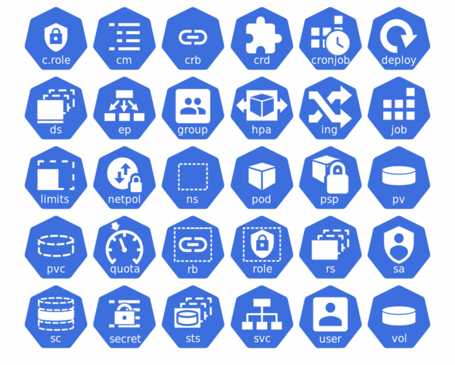

# Введение в Kubernetes

Эта маленькая лекция предназначена для людей, которые уже что-то слышали про Kubernetes,
возможно смотрели в его документацию и даже собирали кластер у себя на коленке, однако
до сих пор не понимают из-за чего весь хайп и почему так мощны его лапищи...

---

## Предыстория

Чтобы понять Kubernetes,
необходимо проследить развитие нижележащих технологий и предшествующих подходов

---

### Физика, виртуализация и контейнеризация

---

### Смешанный вариант

---

#### Виртуализация

Один гипервизор, несколько полноценных ОС
Провиженинг ОС, настройка и запуск ПО на ВМ ничем не отличается от этих процедур на железе

* Установка ПО и зависимостей на ОС: для разного ПО зависимости могут конфликтовать
* Настройка ОС: конфиги, переменные окружения, данные
* Запуск ПО в виде системной службы

---

#### Контейнеризация

Общая операционная система, общее ядро
Провиженинг, настройка и запуск ПО проходят совершенно по-другому

* Необходимо и достаточно: установка и настройка Container Runtime
* Сборка или использование готового **образа**
* Конфликта зависимостей ПО не происходит
* Данные и конфиги монтируются через Volumes
* Переменные окружения задаются явно в манифесте сборки образа и при запуске контейнера

---

## Почему выстрелил именно Docker?

Контейнеризация Docker использует механизмы изоляции

* Механизмы изоляции известны с допотопных времён
* Почему же выстрелил именно Docker?

---

### Блеск и нищета экосистемы Docker

---

#### Блеск

---

##### Манифест: унификация сборки

* Dockerfile: единый формат манифеста сборки
* docker build: сборка на любой ОС с Docker на борту
* Переиспользование через FROM (пушка!)
* Мультистейдж билды (огонь!)

---

##### Образ: унификация доставки

* Централизованное хранение образа в репозитории
* Возможность обмена и переиспользования образов
* Переиспользование слоёв и оптимизация занимаемого дискового пространства
* Хранение только необходимых рантайм зависимостей для запуска целевого ПО
* Гарантированный запуск на любой ОС с подходящим рантаймом

---

##### Сообщество: ключ к популярности

* Возможность обмениваться как манифестами так и готовыми образами
* -> Dockerhub
* -> экспоненциальный рост коммьюнити

---

#### Нищета

---

##### docker-compose

Недостаточен

* Идеален для управления контейнерами одной машины
* Манифест cлишком беден для уровня облака или датацентра
* На нескольких машинах нужен Docker Swarm

---

##### Docker Swarm

Уныл чуть менее, чем полностью

* Кластер контейнеризированных рабочих нагрузок - это не набор контейнеров, а гораздо более сложная система
* Катастрофически не хватает абстракций окружения: ингрессы, сервисы (k8s), PVC, PV
* Окружение (хранилища, конфиги, данные) **не** следует за контейнером автоматически
* Нет инструментов управления окружающей платформой изнутри
* Нужен настоящий **оркестратор**!

---

## Битва оркестраторов

Let Mortal Kombat begin!

---

### Побежденные

* **2009** Apache Mesos + Marathon + Chronos
* **2014** Docker Swarm
* **2014** CoreOS Fleet
* **2015** Rancher Cattle
* **2015** Nomad (HashiCorp)
* **2015** OpenStack Magnum
* Тысячи их, в том числе проприетарных

---

### Победитель - Kubernetes

Почему Kubernetes победил?
За исключением того, что Kubernetes - это наследие Google :)

---

## Концепция Kubernetes

https://kubernetes.io/docs/concepts/

---

### Гениальность концепции

* Создатели Kubernetes - гении, прошедшие через кровь, боль, пот и слёзы
* Универсальная, бесконечно расширяемая концепция для оркестратора контейнеризированных рабочих нагрузок

---

### Основные аспекты

---

#### Декларативное управление

---

---

* Всё есть объект или список объектов
* Состояние каждого объекта - state machine (конечный автомат)
* Работа с Kubernetes только через API
* API отдаёт текущее реальное состояние объектов
* API принимает новое "желаемое" состояние объектов
* Kubernetes пытается привести реальное состояние объектов к желаемому **внутренними средствами**
* Бриллиант концепции: прямое управление состоянием отсутсвует в принципе
* **C**ustom **R**esource **D**efinitions вписаны в концепцию для бесконечного расширения возможностей ванильного k8s

---

#### Pod как атом исполнения рабочей нагрузки

* Pod - связанная одним жизненным циклом совокупность контейнеров
* Под может (и будет) умирать в случайный момент времени: единственное требование к внутреннему ПО
* Стабильность работы приложения при возможности внезапной смерти пода обеспечивается способом организации подов
* Окружение и данные вынесены из пода и **следуют за ним**

---

#### Самовосстановление

* Если группа подов контролируется ReplicaSet, то при смерти пода на его место создастся и встанет другой такой же
* Kubernetes постоянно (в петле) пытается устранить любое несоотвествие между желаемым и реальным состоянием любого объекта в кластере

---

#### Горизонтальное масштабирование
* Статическое: `replicas`
* Динамическое через **H**orizontal **P**od **A**utoscaler

---

#### Непрямые связи между объектами

* labels, labelMatchers, fieldSelectors: теория множеств для самых маленьких
* Позволяет сохранять связи между группами объектов, изменяющими свой состав
* Типичный пример: отношение Service - группа подов

---

#### Namespaces

Способ разделения кластера на тенанты

* Объекты делятся на два типа
  * namespaced
  * clusterwide

---

#### Конфигурация через ConfigMaps и Secrets

* Использование как для переменных окружения, так и для Read-Only конфигов
* Секреты можно шифровать через Vault или аналоги

---

#### Декларативное управление хранилищем

* **P**ersistent **V**olume **C**laims
* **V**olume **C**laim **T**emplates для StatefulSet
* Volume Mounts - способ привязки как хранилищ, так и ConfigMaps + Secrets

---

### Способы организации подов

Kubernetes в стандартной поставке в этом плане беден как церковная мышь

* Just Pod - fire and forget
* DaemonSet
* Job
* CronJob
* Deployment -> ReplicaSet
  * стратегии RollingUpdate и Recreate
* StatefulSet:
  * стратегии RollingUpdate и OnDelete
* Дополнительные стратегии через внешний оператор
  * Blue / Green: Recreate наоборот
  * Canary: RollingUpdate на стероидах

---

### Другие абстракции

Те самые, которых не хватает Swarm / docker-compose
Абстракции над нижележащей инфраструктурой

* Service (правила iptables или eBPF) - прокси для обращения к группе подов
* Ingress / ApiGateway (управление Nginx, Traefik, Envoy и т.д.) - общение приложений с внешним миром
* StorageClass, PVC, PV - хранение данных
* CRD как способ порождать новые абстракции для всего
* Kubernetes Operator как способ реализации CRD

---

## Устройство кластера Kubernetes

Архитектурно Kubernetes довольно прост, количество отдельных компонентов измеряется в штуках

---

---

### Базовые компоненты рабочей ноды

* kubelet - универсальный агент Kubernetes на каждой ноде
* kube-proxy (опционально) - сетевой прокси агент на ноде
* Container Runtime Environment (containerd, cri-o, cri-dockerd)

---

### Дополнительные компоненты control-plane

* kube-api-server - обработчик API запросов к Kubernetes
* etcd (может быть внешним) - хранилище данных для kube-api-server
* scheduler - ищет подходящие ноды чтобы запустить на них новосозданные поды
* kube-control-manager - базовые control loops; управление состоянием встроенных (не CRD) объектов
* cloud-controller-manager (опционально) - работа Kubernetes с нижележащей платформой (облаком)
* coredns - внутренний DNS кластера

---

### Абстракции, реализация которых необходима

---

#### **C**ontainer **R**untime **I**nterface

Обеспечивает связь с Container Runtime

* containerd (доминирующий)
* CRI-O
* Docker, cri-dockerd (избыточен, поддержка прекращена)
* Многие другие

---
#### **C**ontainer **N**etwork **I**nterface

Eдиное сетевое пространство вне зависимости от расположения физических нод кластера

* Flannel
* Calico
* Weave Net
* **Cilium** - one love

---

### **C**ontainer **S**torage **I**nterface

* обеспечивают работоспособность StorageClass, а соотвественно PVC, PV
* формально не является необходимой, но любой нетривиальный кластер без неё не обходится
* реализации
  * Облачные - тысячи их!
  * Enterprise - тоже много
  * Rook / Ceph CSI
  * Longhorn
  * Portworx CSI
  * LINSTORE CSI
  * GlusterFS CSI
  * [тысячи их](https://kubernetes-csi.github.io/docs/drivers.html)

---

### Джентльменский набор

* Service Mesh - выделенный слой инфраструктуры для общения микросервисов
  * Istio
  * Cilium Service Mesh
* Certificate Management (cert-manager)
* ArgoRollouts (стратегии обновления групп подов)
* Логирование (Elastic Vector Kibana)
* Метрики (Prometheus, VictoriaMetrics, Thanos, Mimir, тысячи их)
* Cбор ошибок (Sentry)
* Distributed Tracing (OpenTelemetry, Jaeger)

---

## Способы доставки приложений в кластер Kubernetes

* kubectl apply
* Kustomize - иерархический layering
* Helm - темплейты, зависимости, ArtifactHub (наш выбор)
* Grafana Tanka - инопланетные технологии на Jsonnnet
  * Поддерживает Helm
* При прочих равных темплейты побеждают layering

---

### Анатомия Helm чарта

* Helm Chart - это хранимый пакет
* Dependencies (пушка!)
* Первые два пункта - причина взлёта популярности ракетой в небеса
* Templates - gotpl + sprig: простота ~~хуже воровства~~
* Helpers
* Tests

---

## Практическая часть

Деплой простейшего чарта

---

## Спасибо за внимание

https://github.com/Antiarchitect/k8s-introduction

